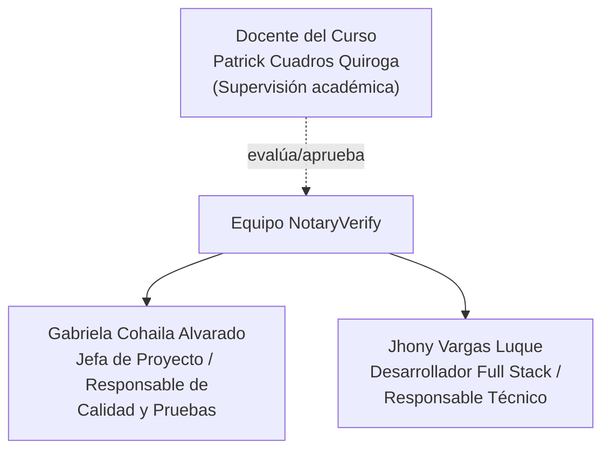
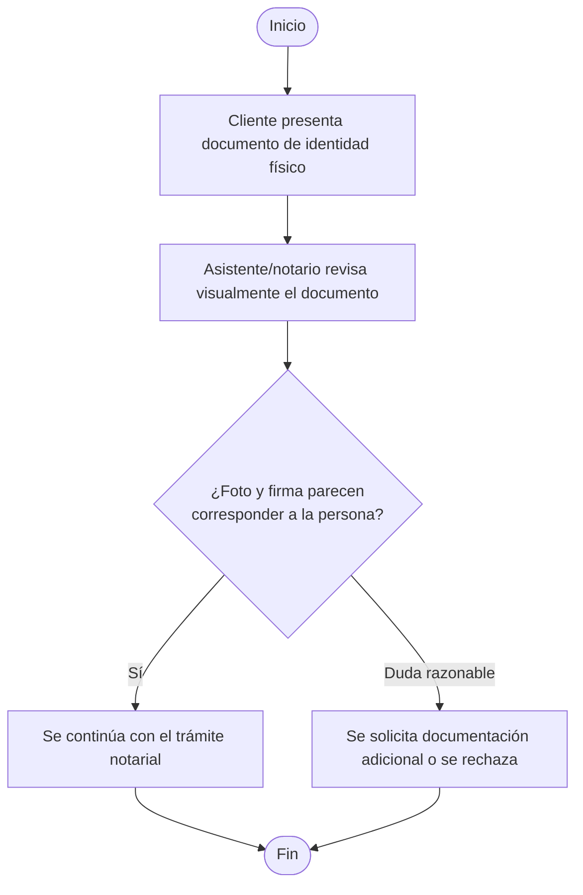
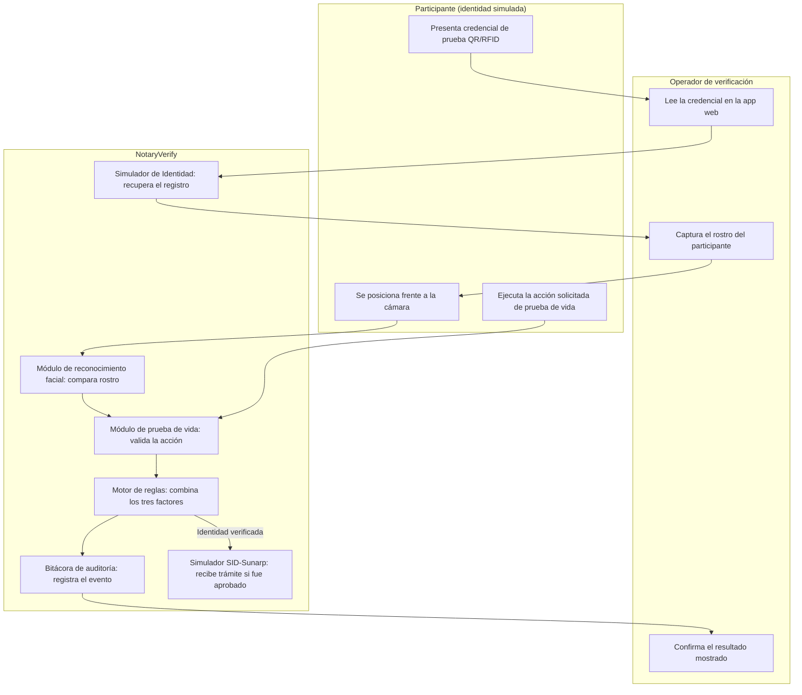
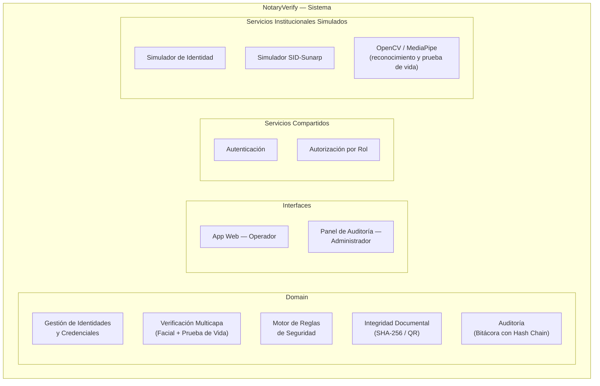
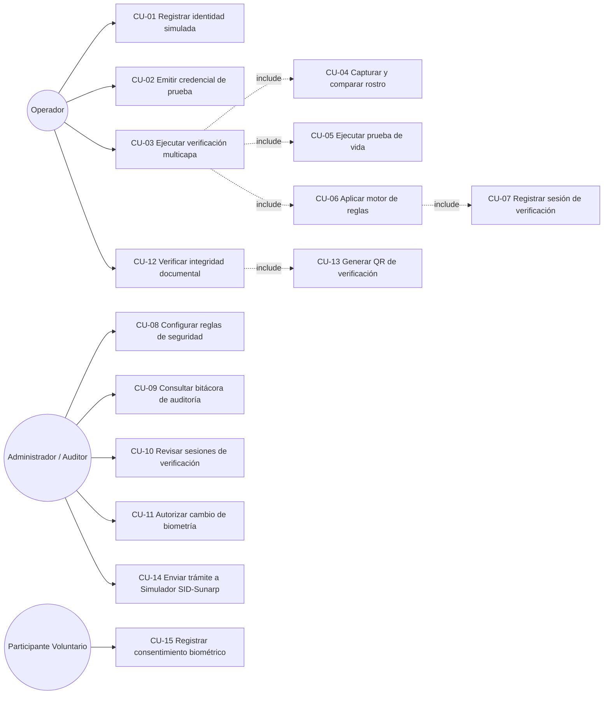
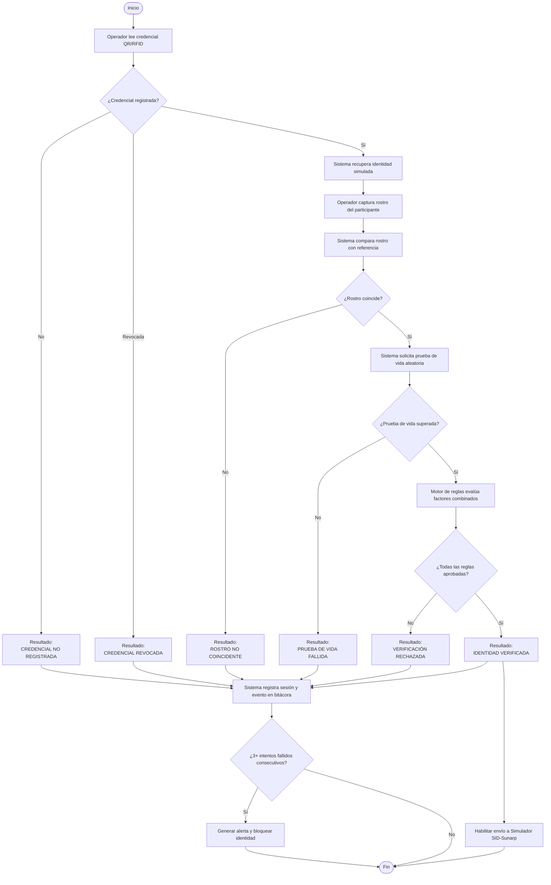
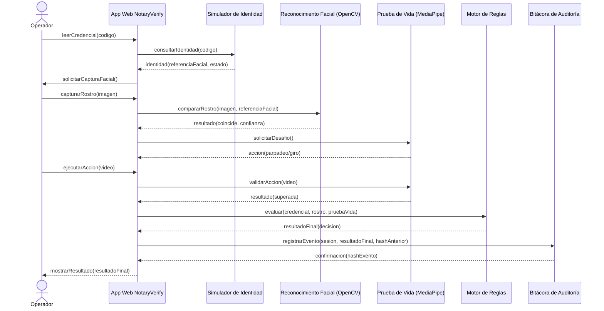
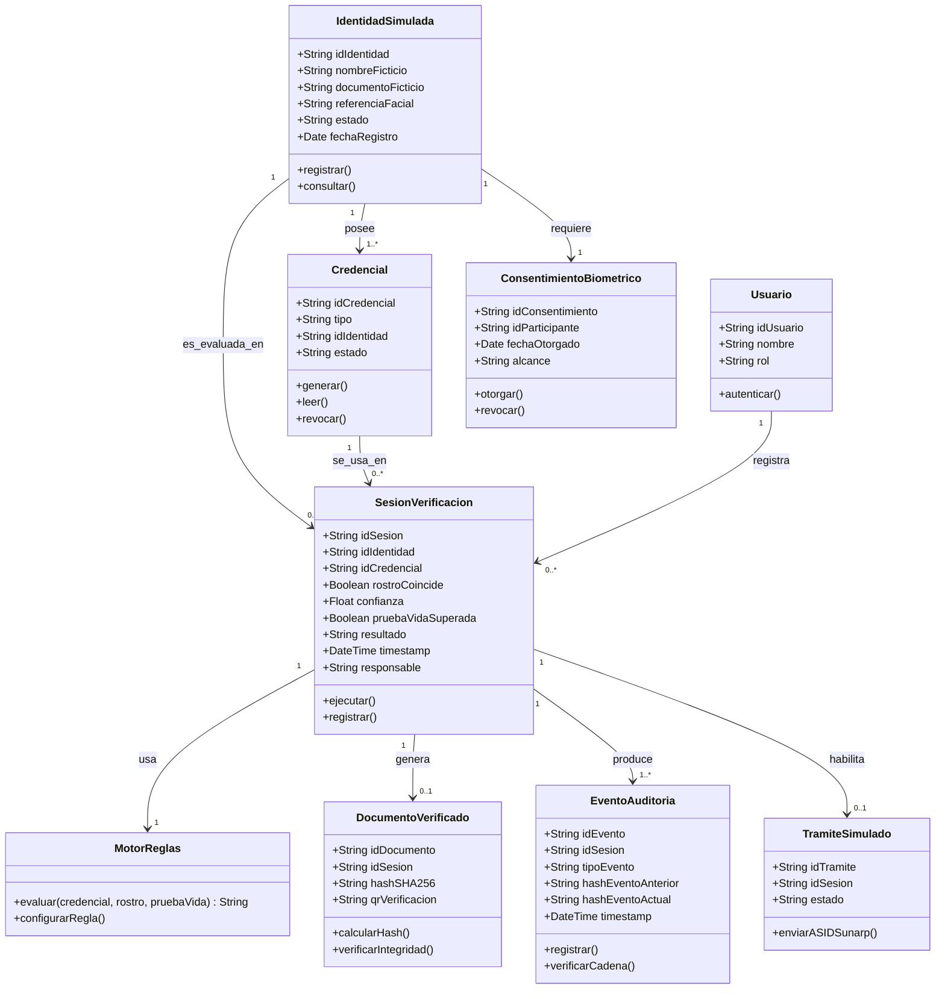

**UNIVERSIDAD PRIVADA DE TACNA**

**FACULTAD DE INGENIERIA**

**Escuela Profesional de Ingeniería de Sistemas**

**Proyecto *NotaryVerify***

Curso: *Calidad y Pruebas de Software*

Docente: *Patrick Jose Cuadros Quiroga*

Integrantes:

***Cohaila Alvarado, Gabriela Estefania (2022075746)***

***Vargas Luque, Jhony (2022075754)***

**Tacna – Perú**

***2026***

\pagebreak

Sistema *NotaryVerify*

Especificación de Requerimientos de Software (SRS)

Versión *1.0*

|CONTROL DE VERSIONES||||||
| :-: | :- | :- | :- | :- | :- |
|Versión|Hecha por|Revisada por|Aprobada por|Fecha|Motivo|
|1\.0|GC, JV|PJCQ|PJCQ|25/08/2026|Versión Original|

\pagebreak

# ÍNDICE GENERAL

1. GENERALIDADES DEL PROYECTO
   1.1. Nombre del proyecto
   1.2. Visión
   1.3. Misión
   1.4. Organigrama del equipo
2. VISIONAMIENTO
   2.1. Descripción del problema
   2.2. Objetivos de investigación
   2.3. Objetivos de diseño
   2.4. Alcance del sistema
   2.5. Viabilidad del sistema
   2.6. Información obtenida del levantamiento de información
3. ANÁLISIS DE PROCESOS
   3.1. Diagrama del proceso Actual
   3.2. Diagrama del proceso Propuesto
4. ESPECIFICACIÓN DE REQUERIMIENTOS DE SOFTWARE
   4.1. Cuadro de Requerimientos Funcionales Inicial
   4.2. Cuadro de Requerimientos No Funcionales
   4.3. Cuadro de Requerimientos Funcionales Final
   4.4. Reglas de Negocio
5. FASE DE DESARROLLO
   5.1. Perfiles de Usuario
   5.2. Modelo Conceptual (Diagrama de Paquetes, Casos de Uso, Escenarios)
   5.3. Modelo Lógico (Objetos del Dominio, Actividades, Secuencia, Clases)

CONCLUSIONES
RECOMENDACIONES
BIBLIOGRAFÍA
WEBGRAFÍA

\pagebreak

## INTRODUCCIÓN

El presente documento constituye la Especificación de Requerimientos de Software (SRS) del sistema **NotaryVerify**, desarrollado por el equipo del proyecto como prototipo experimental de verificación multicapa de identidad para trámites notariales. Este informe establece de manera formal y detallada los requerimientos funcionales, no funcionales y las reglas de negocio que guían el diseño, desarrollo e implementación del sistema.

NotaryVerify combina una aplicación web, un Simulador de Identidad, credenciales de prueba (QR/RFID), reconocimiento facial local (OpenCV), prueba de vida experimental (MediaPipe), un motor de reglas de seguridad multicapa, integridad documental mediante SHA-256 y una bitácora de auditoría con encadenamiento criptográfico. El sistema opera exclusivamente sobre identidades ficticias y datos biométricos de participantes voluntarios; no sustituye a Reniec, al SID-Sunarp ni a la firma digital oficial.

La elaboración de este documento es consistente con los documentos FD01 (Informe de Factibilidad) y FD02 (Documento de Visión) previamente elaborados para el mismo proyecto.

> **Nota sobre notación:** los diagramas UML de este documento se representan en sintaxis **Mermaid**, embebida directamente en el Markdown. GitHub renderiza estos bloques como diagramas visuales nativos (casos de uso, actividades, secuencia y clases), sin necesidad de herramientas externas como Rational Rose.

\pagebreak

## 1. GENERALIDADES DEL PROYECTO

### 1.1. Nombre del proyecto

NotaryVerify – Sistema Experimental de Verificación de Identidad para Trámites Notariales.

### 1.2. Visión

Convertirse en una base de investigación académica de referencia para la aplicación de verificación multicapa de identidad en el sector notarial y registral peruano, demostrando de forma experimental si la combinación de credenciales electrónicas, biometría facial, prueba de vida, reglas de seguridad, integridad documental y auditoría criptográfica permite detectar con mayor eficacia los intentos de suplantación de identidad.

### 1.3. Misión

Desarrollar y evaluar, dentro de un entorno académico controlado y sin utilizar información real de clientes de una notaría, un prototipo funcional que combine múltiples factores de verificación de identidad, generando evidencia técnica medible (tasas de aceptación, rechazo, falsos positivos y falsos negativos) sobre la efectividad de dicho enfoque.

### 1.4. Organigrama del equipo

\pagebreak

## 2. VISIONAMIENTO

### 2.1. Descripción del problema

Las notarías intervienen en la formalización de actos y documentos jurídicos en los que la correcta identificación de las personas es un elemento fundamental. Una suplantación de identidad puede permitir que una persona intervenga en un trámite utilizando la identidad de otra, con consecuencias jurídicas, administrativas y registrales. En junio de 2026, la Sunarp declaró procedente una anotación preventiva notarial por presunta suplantación de identidad relacionada con una escritura pública, y durante el mismo año se emitieron resoluciones de cancelación de asientos registrales por falsificación documental (Sunarp, 2026a; Sunarp, 2026b).

El sistema registral peruano ya cuenta con mecanismos oficiales (SID-Sunarp, firma digital obligatoria desde 2023), pero no existe evidencia pública de una capa adicional de verificación biométrica y de prueba de vida aplicada como control experimental previo. Persisten además restricciones normativas relevantes: la Ley N.° 29733 y su Reglamento (D.S. N.° 016-2024-JUS) reconocen los datos biométricos como información sensible, lo que exige que cualquier prototipo experimental opere exclusivamente con identidades ficticias y datos autorizados por voluntarios.

### 2.2. Objetivos de investigación

- Identificar y documentar al menos cinco escenarios de suplantación de identidad aplicables a trámites notariales.
- Analizar los mecanismos oficiales de identificación existentes, diferenciándolos de los controles que pueden complementarse experimentalmente mediante software.
- Definir al menos diez reglas de seguridad relacionadas con identidad, credenciales, biometría, prueba de vida e integridad documental.
- Analizar los riesgos del tratamiento de información biométrica, garantizando que el 100 % de las pruebas se ejecuten sin datos reales de clientes.
- Diseñar escenarios controlados de ataque (persona no registrada, rostro incorrecto, fotografía estática, credencial inválida/revocada, documento modificado, intentos consecutivos).

### 2.3. Objetivos de diseño

- Diseñar un flujo de verificación lineal y comprensible (credencial → captura facial → prueba de vida → resultado), ejecutable por un operador sin experiencia técnica avanzada.
- Diseñar un motor de reglas configurable que combine múltiples factores sin depender de uno solo.
- Diseñar una bitácora de auditoría con encadenamiento criptográfico que permita detectar alteraciones sobre el historial protegido.
- Diseñar el mecanismo de integridad documental basado en SHA-256, evitando el almacenamiento de datos biométricos dentro de las credenciales QR/RFID.
- Asegurar que el sistema cumpla con ISO/IEC 25010 en funcionalidad, fiabilidad, usabilidad, seguridad y mantenibilidad.

### 2.4. Alcance del sistema

**Dentro del alcance:**

- Simulador de Identidad (API propia) para registrar y consultar identidades ficticias.
- Emisión y lectura de credenciales de prueba QR/RFID.
- Reconocimiento facial local (OpenCV) y prueba de vida experimental (MediaPipe).
- Motor de reglas de seguridad multicapa.
- Integridad documental mediante SHA-256 y códigos QR de verificación.
- Bitácora de auditoría con encadenamiento criptográfico.
- Simulador SID-Sunarp para trámites ficticios ya verificados.

**Fuera del alcance:**

- Integración real con Reniec, el SID-Sunarp oficial o la firma digital oficial.
- Uso de información personal o biométrica real de clientes de una notaría.
- Cualquier valor de identificación legal de los resultados obtenidos.
- Comercialización o despliegue en producción ante una notaría real.
- El proyecto se ejecuta entre el 25 de agosto de 2026 y el 12 de diciembre de 2026, con una inversión estimada de S/. 9,573.32 (FD01).

### 2.5. Viabilidad del sistema

| Dimensión | Resultado | Sustento |
| :- | :-: | :- |
| Técnica | Viable | OpenCV, MediaPipe, lectores QR/RFID y componentes de hardware (cámara, lector RFID) son accesibles y están documentados. |
| Económica | Viable (escenario hipotético) | Inversión: S/. 9,573.32. VAN = S/. 1,451.08 (> 0); TIR = 20.65 % (> COK 12 %); B/C = 1.82 (FD01). |
| Operativa | Viable | Flujo intuitivo, operable por dos integrantes y voluntarios capacitados en sesiones breves. |
| Legal | Viable con restricciones | Cumple Ley N.° 29733 y su Reglamento; no sustituye a Reniec/SID-Sunarp; solo identidades ficticias. |
| Social / Ambiental | Viable | Alineado a ODS 9 y ODS 16; bajo consumo energético; reduce el uso de papel. |

El cronograma de ejecución comprende desde el 25 de agosto de 2026 hasta el 12 de diciembre de 2026, distribuido en sprints quincenales.

### 2.6. Información obtenida del levantamiento de información

El levantamiento de información se realizó mediante revisión documental y normativa (no existe un cliente real que entrevistar), dado el carácter experimental del proyecto.

| Técnica aplicada | Fuente | Hallazgo principal |
| :- | :- | :- |
| Revisión documental | Resoluciones Sunarp 2026a y 2026b | Existen casos recientes y documentados de suplantación de identidad y falsificación documental en el entorno notarial/registral peruano. |
| Revisión normativa | Ley N.° 29733 y D.S. N.° 016-2024-JUS | Los datos biométricos son información sensible; su tratamiento exige medidas de protección especiales y consentimiento expreso. |
| Revisión normativa | Res. N.° 169-2023-SUNARP/SN | Los partes notariales con actos inscribibles deben expedirse con firma digital y presentarse mediante SID-Sunarp desde noviembre de 2023. |
| Benchmarking técnico | Documentación de OpenCV y MediaPipe | Existen modelos de reconocimiento facial (SFace) y de detección de puntos faciales de código abierto, sin costo de licenciamiento, viables para un prototipo académico. |
| Validación académica | Docente del curso (Calidad y Pruebas de Software) | El proyecto debe mantener trazabilidad entre requerimientos, reglas de negocio y casos de prueba, con métricas verificables (cobertura, defectos críticos). |

\pagebreak

## 3. ANÁLISIS DE PROCESOS

### 3.1. Diagrama del proceso Actual (AS-IS)

Proceso manual típico de verificación de identidad en un trámite notarial, sin capa biométrica adicional:

La verificación depende exclusivamente del criterio visual del personal, sin un segundo factor biométrico, sin prueba de vida y sin registro trazable de qué controles se aplicaron.

### 3.2. Diagrama del proceso Propuesto (TO-BE)

Proceso experimental de NotaryVerify, organizado por responsable:

\pagebreak

## 4. ESPECIFICACIÓN DE REQUERIMIENTOS DE SOFTWARE

### 4.1. Cuadro de Requerimientos Funcionales Inicial

Requerimientos identificados a partir de los objetivos de solución definidos en el FD02 (Documento de Visión).

| ID | Requerimiento | Requerimiento Funcional | Prioridad | Origen |
| :- | :- | :- | :-: | :- |
| RF-01 | Registrar identidad simulada | El sistema debe permitir registrar una identidad ficticia en el Simulador de Identidad, con documento ficticio, nombres, fotografía de referencia y estado. | Alta | Investigador/Proceso |
| RF-02 | Consultar identidad | El sistema debe permitir consultar una identidad registrada mediante su identificador de credencial. | Alta | Proceso |
| RF-03 | Emitir credencial de prueba | El sistema debe permitir generar una credencial de prueba (QR o RFID) asociada a una identidad simulada. | Alta | Operador |
| RF-04 | Leer credencial | El sistema debe permitir leer una credencial de prueba para recuperar el registro correspondiente, sin aprobar la identidad por sí sola. | Alta | Operador / Hardware |
| RF-05 | Capturar rostro | El sistema debe permitir capturar el rostro del participante mediante cámara durante la verificación. | Alta | Operador / Hardware |
| RF-06 | Comparar rostro | El sistema debe comparar el rostro capturado con la referencia biométrica registrada y devolver una métrica de confianza. | Alta | Proceso / OpenCV |
| RF-07 | Ejecutar prueba de vida | El sistema debe solicitar una acción aleatoria (parpadeo, giro de rostro) y validar su cumplimiento mediante MediaPipe. | Alta | Proceso |
| RF-08 | Aplicar motor de reglas | El sistema debe combinar los resultados de credencial, rostro y prueba de vida para determinar el resultado final de la verificación. | Alta | Lógica de negocio |
| RF-09 | Registrar sesión de verificación | El sistema debe registrar cada sesión con los factores utilizados, resultados, fecha, hora y responsable. | Alta | Auditoría |
| RF-10 | Calcular hash documental | El sistema debe calcular el hash SHA-256 de un documento de prueba generado tras una verificación aprobada. | Alta | Proceso |
| RF-11 | Verificar integridad documental | El sistema debe comparar el hash almacenado con el hash actual de un documento para detectar modificaciones. | Alta | Auditoría |
| RF-12 | Generar QR de verificación | El sistema debe generar un código QR de verificación asociado al documento de prueba, sin incluir información personal. | Media | Proceso |
| RF-13 | Registrar evento de auditoría | El sistema debe registrar cada operación crítica en la bitácora, enlazándola criptográficamente con el evento anterior. | Alta | Auditoría |
| RF-14 | Detectar alteración de bitácora | El sistema debe detectar si algún evento de la bitácora fue alterado, verificando el encadenamiento. | Alta | Auditoría |
| RF-15 | Enviar trámite al Simulador SID-Sunarp | El sistema debe permitir enviar un trámite ficticio al Simulador SID-Sunarp solo si la sesión asociada fue aprobada. | Media | Proceso |
| RF-16 | Simular escenarios de servicio externo | El Simulador SID-Sunarp debe representar escenarios de disponibilidad, error de respuesta y tiempo de espera agotado. | Media | Continuidad |

### 4.2. Cuadro de Requerimientos No Funcionales

| ID | Requerimiento No Funcional | Categoría | Criterio de aceptación |
| :- | :- | :- | :- |
| RNF-01 | La interfaz debe permitir a un operador sin experiencia técnica completar el flujo de verificación en no más de 4 pasos. | Usabilidad | Prueba de usabilidad: tasa de éxito ≥ 90 % en primera sesión. |
| RNF-02 | La comparación facial debe completarse en menos de 3 segundos por intento. | Rendimiento | Prueba de carga: 20 comparaciones, latencia promedio < 3 s. |
| RNF-03 | El entorno de pruebas/staging debe estar disponible al menos el 95 % del tiempo durante el periodo de evaluación. | Disponibilidad | Monitoreo de uptime durante el semestre. |
| RNF-04 | El proceso completo de verificación (credencial → resultado) no debe superar los 45 segundos en condiciones normales. | Eficiencia | Prueba de campo: 20 sesiones, tiempo promedio < 45 s. |
| RNF-05 | La tasa combinada de falsos positivos del módulo biométrico y de prueba de vida debe ser inferior al 5 % en los escenarios evaluados. | Precisión biométrica | Evaluación con ≥ 100 intentos controlados (FD02). |
| RNF-06 | El sistema debe autenticar a operadores y administradores antes de permitir el acceso a sesiones o configuración de reglas. | Seguridad | Prueba de acceso: ningún acceso no autenticado a datos sensibles. |
| RNF-07 | Los datos entre el frontend y las APIs deben viajar cifrados mediante HTTPS/TLS 1.2 o superior. | Seguridad | Verificación de certificados; sin comunicación HTTP plana. |
| RNF-08 | La aplicación web debe funcionar correctamente en Chrome, Edge y Firefox en sus versiones vigentes. | Compatibilidad | Pruebas cruzadas en los tres navegadores. |
| RNF-09 | El código fuente debe organizarse por capas, con documentación técnica suficiente para su continuidad académica. | Mantenibilidad | Revisión de código: documentación ≥ 70 % en módulos críticos. |
| RNF-10 | La bitácora de auditoría debe permitir reconstruir el 100 % de las operaciones críticas de una sesión, incluso ante fallos parciales. | Recuperabilidad / Trazabilidad | Prueba de alteración deliberada: 100 % de casos detectados. |

### 4.3. Cuadro de Requerimientos Funcionales Final

Los requerimientos finales consolidan los iniciales tras el análisis de los casos de uso (sección 5.2.3), añadiendo los requerimientos de configuración, autenticación y supervisión.

| ID | Requerimiento | Descripción | Prioridad |
| :- | :- | :- | :-: |
| RF-01 | Registrar identidad simulada | Registrar una identidad ficticia con documento, nombre, fotografía de referencia y estado en el Simulador de Identidad. | Alta |
| RF-02 | Consultar identidad | Consultar una identidad registrada a partir del código de su credencial. | Alta |
| RF-03 | Emitir credencial de prueba | Generar una credencial QR o RFID asociada a una identidad simulada. | Alta |
| RF-04 | Leer credencial | Leer la credencial presentada y recuperar únicamente el registro a verificar. | Alta |
| RF-05 | Capturar y comparar rostro | Capturar el rostro del participante y compararlo con la referencia biométrica, devolviendo una métrica de confianza. | Alta |
| RF-06 | Ejecutar prueba de vida | Solicitar una acción aleatoria y validar su cumplimiento mediante análisis de puntos faciales. | Alta |
| RF-07 | Aplicar motor de reglas | Evaluar de forma combinada credencial, rostro y prueba de vida, y emitir un resultado único. | Alta |
| RF-08 | Registrar sesión de verificación | Registrar la sesión completa: factores usados, resultados, fecha, hora y responsable. | Alta |
| RF-09 | Calcular y verificar integridad documental | Calcular el hash SHA-256 de un documento de prueba y verificar su integridad posteriormente. | Alta |
| RF-10 | Generar QR de verificación | Generar un código QR de verificación para el documento de prueba, sin datos personales embebidos. | Media |
| RF-11 | Registrar y encadenar eventos de auditoría | Registrar cada operación crítica en la bitácora, enlazándola criptográficamente con el evento previo. | Alta |
| RF-12 | Detectar alteración de bitácora | Verificar el encadenamiento de eventos para detectar alteraciones. | Alta |
| RF-13 | Enviar trámite al Simulador SID-Sunarp | Enviar un trámite ficticio únicamente si la sesión de verificación asociada fue aprobada. | Media |
| RF-14 | Simular escenarios de servicio externo | Representar disponibilidad, error de respuesta y timeout en el Simulador SID-Sunarp. | Media |
| RF-15 | Autenticar usuarios del sistema | Autenticar a operadores y administradores antes de permitir operaciones sobre el sistema. | Alta |
| RF-16 | Configurar reglas de seguridad | Permitir al administrador configurar las combinaciones de factores que determinan cada resultado. | Alta |
| RF-17 | Consultar bitácora de auditoría | Permitir al administrador/auditor consultar el historial completo de eventos registrados. | Alta |
| RF-18 | Filtrar sesiones de verificación | Permitir filtrar las sesiones registradas por resultado, fecha o identidad evaluada. | Media |
| RF-19 | Registrar consentimiento biométrico | Registrar el consentimiento expreso de cada participante voluntario antes de enrolar su rostro. | Alta |

### 4.4. Reglas de Negocio

| ID | Regla de Negocio | Descripción | Impacto en el sistema |
| :- | :- | :- | :- |
| RN-01 | Ningún factor aprueba por sí solo | Una credencial válida sin coincidencia facial, o sin prueba de vida superada, no puede producir "IDENTIDAD VERIFICADA". | Validación obligatoria en el motor de reglas antes de emitir el resultado final. |
| RN-02 | Identidad ficticia obligatoria | No se permite registrar identidades con datos reales de personas ajenas al proyecto; toda identidad debe marcarse explícitamente como ficticia. | Validación en el formulario de registro del Simulador de Identidad. |
| RN-03 | Consentimiento biométrico previo | No se puede enrolar el rostro de un participante sin un registro de consentimiento expreso asociado. | Bloqueo del enrolamiento facial hasta confirmar el consentimiento (RF-19). |
| RN-04 | Revocación de credencial | Una credencial marcada como revocada rechaza automáticamente cualquier intento de verificación, sin importar el resultado biométrico. | Verificación de estado de credencial como primer paso del flujo. |
| RN-05 | Límite de intentos fallidos | Tres o más intentos fallidos consecutivos sobre una misma identidad generan una alerta y bloquean temporalmente nuevos intentos. | Contador de intentos fallidos por identidad con bloqueo temporal automático. |
| RN-06 | Trámite condicionado a verificación aprobada | El Simulador SID-Sunarp solo recibe un trámite ficticio si la sesión asociada tiene resultado "IDENTIDAD VERIFICADA". | Validación previa al llamado al Simulador SID-Sunarp (RF-13). |
| RN-07 | Inmutabilidad de la bitácora | Ningún evento de auditoría puede eliminarse o editarse; solo se permiten nuevos eventos enlazados criptográficamente. | Bitácora de solo-anexado (append-only) con encadenamiento de hashes. |
| RN-08 | Documento sin huella válida no es verificable | Un documento cuyo hash SHA-256 no coincide con el registrado se marca como "integridad no verificada" y no puede asociarse a un trámite aprobado. | Validación de integridad antes de habilitar el envío del trámite. |
| RN-09 | Cambio de biometría requiere autorización | Toda actualización de la referencia facial de una identidad simulada requiere aprobación de un usuario con rol administrador. | Flujo de aprobación en dos pasos para actualización de biometría. |
| RN-10 | Vigencia de sesión | Una sesión de verificación iniciada y no completada en 10 minutos expira automáticamente y requiere reinicio del flujo. | Tarea de expiración automática sobre sesiones en estado "en curso". |

\pagebreak

## 5. FASE DE DESARROLLO

### 5.1. Perfiles de Usuario

| Perfil | Descripción | Conocimientos tecnológicos | Interacción con el sistema | Permisos |
| :- | :- | :- | :- | :- |
| Operador de Verificación | Integrante del equipo o voluntario capacitado que ejecuta el flujo de verificación con los participantes. | Manejo básico de una aplicación web y de una cámara. | App web: lee la credencial, captura el rostro, ejecuta la prueba de vida y visualiza el resultado. | Registro y ejecución de sesiones de verificación. Sin acceso a configuración de reglas ni a la bitácora completa. |
| Administrador / Auditor | Integrante del equipo responsable de configurar reglas y supervisar la trazabilidad del sistema. | Manejo de aplicaciones web y comprensión de reglas de seguridad. | Panel de auditoría: configura reglas, revisa sesiones, consulta la bitácora y autoriza cambios de biometría. | Acceso completo: configuración de reglas, consulta de bitácora, aprobación de cambios biométricos, gestión de credenciales. |
| Participante Voluntario | Persona que autoriza el uso de su rostro para representar una identidad ficticia en las pruebas. | Ninguno específico. | Presenta su rostro durante el enrolamiento y en los intentos de verificación; otorga consentimiento expreso. | Solo puede autorizar/revocar su consentimiento; no tiene acceso a la aplicación ni al panel. |

### 5.2. Modelo Conceptual

#### 5.2.1. Diagrama de Paquetes

#### 5.2.2. Diagrama de Casos de Uso

#### 5.2.3. Escenarios de Caso de Uso

**CU-01: Registrar identidad simulada**

| Campo | Descripción |
| :- | :- |
| Caso de Uso | CU-01 – Registrar identidad simulada |
| Actor | Operador de Verificación |
| Precondición | El operador cuenta con datos ficticios y, si corresponde, con una fotografía de un participante voluntario que ya otorgó su consentimiento (CU-15). |
| Postcondición | La identidad queda registrada en el Simulador de Identidad con estado "activa" y disponible para asociarse a una credencial. |
| Flujo principal | 1. El operador accede al módulo de registro del Simulador de Identidad. 2. Ingresa documento ficticio, nombres simulados y fotografía de referencia. 3. El sistema valida que el consentimiento del participante exista (RN-03). 4. El sistema registra la identidad con estado "activa". 5. El sistema muestra el identificador generado para la identidad. |
| Flujo alternativo | A1. Si no existe un registro de consentimiento válido, el sistema rechaza el registro y solicita completar CU-15 primero. |
| Excepciones | E1. Si el servicio del Simulador de Identidad no responde, el sistema muestra un mensaje de error y sugiere reintentar. |

**CU-03: Ejecutar verificación multicapa**

| Campo | Descripción |
| :- | :- |
| Caso de Uso | CU-03 – Ejecutar verificación multicapa |
| Actor | Operador de Verificación |
| Precondición | Existe al menos una identidad simulada activa con una credencial de prueba emitida (CU-01, CU-02). |
| Postcondición | Se registra una sesión de verificación con el resultado final y su evento correspondiente en la bitácora de auditoría. |
| Flujo principal | 1. El operador lee la credencial de prueba (QR/RFID) del participante. 2. El sistema consulta el Simulador de Identidad y recupera el registro esperado (RF-04). 3. El sistema solicita la captura facial del participante. 4. El operador captura el rostro; el sistema lo compara con la referencia registrada (RF-05). 5. El sistema solicita una prueba de vida aleatoria (parpadeo o giro de rostro). 6. El participante ejecuta la acción solicitada; el sistema la valida (RF-06). 7. El motor de reglas combina los tres factores y determina el resultado (RF-07, RN-01). 8. El sistema registra la sesión completa y el evento correspondiente en la bitácora (RF-08, RF-11). |
| Flujo alternativo | A1. Si la credencial no está registrada, el resultado es "CREDENCIAL NO REGISTRADA" y el flujo finaliza en el paso 2. A2. Si la credencial está revocada, el resultado es "CREDENCIAL REVOCADA" sin evaluar biometría (RN-04). A3. Si el rostro no coincide, el resultado es "ROSTRO NO COINCIDENTE". A4. Si la prueba de vida no es superada, el resultado es "PRUEBA DE VIDA FALLIDA". |
| Excepciones | E1. Si ocurren tres o más fallos consecutivos sobre la misma identidad, el sistema genera una alerta y bloquea temporalmente nuevos intentos (RN-05). E2. Si la sesión permanece incompleta por más de 10 minutos, expira automáticamente (RN-10). |

**CU-09: Consultar bitácora de auditoría**

| Campo | Descripción |
| :- | :- |
| Caso de Uso | CU-09 – Consultar bitácora de auditoría |
| Actor | Administrador / Auditor |
| Precondición | El administrador ha iniciado sesión en el panel de auditoría (RF-15). |
| Postcondición | El administrador visualiza el historial de eventos y puede verificar la integridad del encadenamiento. |
| Flujo principal | 1. El administrador accede al panel de auditoría. 2. El sistema carga los eventos registrados, ordenados cronológicamente, junto con su hash y el hash del evento anterior. 3. El administrador puede filtrar por sesión, identidad o rango de fechas (RF-18). 4. El administrador solicita verificar el encadenamiento de una sesión específica. 5. El sistema recalcula la cadena de hashes y confirma si es válida (RF-12). |
| Flujo alternativo | A1. Si el sistema detecta una discontinuidad en el encadenamiento, marca el evento como "posible alteración" y lo resalta en el panel. |
| Excepciones | E1. Si no existen eventos para los filtros aplicados, el sistema muestra un mensaje "sin resultados" en lugar de un error. |

### 5.3. Modelo Lógico

#### 5.3.1. Análisis de Objetos del Dominio

| Objeto del dominio | Atributos principales | Responsabilidad en el sistema |
| :- | :- | :- |
| IdentidadSimulada | idIdentidad, nombreFicticio, documentoFicticio, referenciaFacial, estado, fechaRegistro | Representa una identidad ficticia registrada en el Simulador de Identidad, usada como referencia para las verificaciones. |
| Credencial | idCredencial, tipo (QR/RFID), idIdentidad, estado (activa/revocada) | Permite recuperar el registro esperado a verificar; no aprueba una identidad por sí sola (RN-04). |
| SesionVerificacion | idSesion, idIdentidad, idCredencial, rostroCoincide, confianza, pruebaVidaSuperada, resultado, timestamp, responsable | Registra el proceso completo de una verificación y su resultado final. |
| MotorReglas | reglasConfiguradas[] | Evalúa de forma combinada los factores de una sesión y determina el resultado (RN-01). |
| DocumentoVerificado | idDocumento, idSesion, hashSHA256, qrVerificacion | Representa un documento de prueba generado tras una verificación aprobada, con su huella de integridad. |
| EventoAuditoria | idEvento, idSesion, tipoEvento, hashEventoAnterior, hashEventoActual, timestamp | Registra una operación crítica del sistema, enlazada criptográficamente con el evento previo (RN-07). |
| TramiteSimulado | idTramite, idSesion, estado | Representa el envío de un trámite ficticio al Simulador SID-Sunarp, condicionado a una verificación aprobada (RN-06). |
| Usuario | idUsuario, nombre, rol (operador/administrador) | Representa a la persona autenticada que ejecuta o supervisa las sesiones de verificación. |
| ConsentimientoBiometrico | idConsentimiento, idParticipante, fechaOtorgado, alcance | Registra la autorización expresa de un participante voluntario para el uso de su rostro (RN-03). |

#### 5.3.2. Diagramas de Actividades

**Flujo de actividades: Ejecución de una verificación multicapa**

| Actividad | Actor | Decisión / Condición |
| :- | :- | :- |
| 1. Operador lee la credencial de prueba (QR/RFID). | Operador | — |
| 2. Sistema consulta el Simulador de Identidad. | Sistema | Si credencial no registrada → Resultado "CREDENCIAL NO REGISTRADA". |
| 3. Sistema verifica el estado de la credencial. | Sistema | Si está revocada → Resultado "CREDENCIAL REVOCADA" (RN-04). |
| 4. Operador captura el rostro del participante. | Operador | — |
| 5. Sistema compara el rostro con la referencia registrada. | Sistema (OpenCV) | Si no coincide → Resultado "ROSTRO NO COINCIDENTE". |
| 6. Sistema solicita una prueba de vida aleatoria. | Sistema (MediaPipe) | — |
| 7. Participante ejecuta la acción solicitada. | Participante | Si no es superada → Resultado "PRUEBA DE VIDA FALLIDA". |
| 8. Motor de reglas combina los factores evaluados. | Sistema | Si no cumple todas las reglas → "VERIFICACIÓN RECHAZADA". |
| 9. Sistema determina el resultado final. | Sistema | Todas las reglas aprobadas → "IDENTIDAD VERIFICADA". |
| 10. Sistema registra la sesión y el evento en la bitácora. | Sistema | — |
| 11. Sistema evalúa intentos fallidos consecutivos. | Sistema | Si ≥ 3 fallos consecutivos → genera alerta y bloquea la identidad (RN-05). |
| 12. Si el resultado es aprobado, se habilita el envío al Simulador SID-Sunarp. | Sistema | Solo si resultado = "IDENTIDAD VERIFICADA" (RN-06). |

#### 5.3.3. Diagramas de Secuencia

**Secuencia: Ejecución de verificación multicapa**

#### 5.3.4. Diagrama de Clases

\pagebreak

## CONCLUSIONES

El presente documento de Especificación de Requerimientos de Software (SRS) de NotaryVerify establece de manera formal el conjunto completo de requerimientos funcionales (RF-01 a RF-19), no funcionales (RNF-01 a RNF-10) y reglas de negocio (RN-01 a RN-10) que definen el comportamiento esperado del sistema, constituyendo el contrato técnico entre el equipo del proyecto y el docente del curso.

El análisis de procesos AS-IS/TO-BE evidencia que NotaryVerify transforma un proceso de verificación basado únicamente en el criterio visual del personal notarial en un flujo experimental multicapa, trazable y auditable, que combina credenciales electrónicas, biometría facial, prueba de vida, un motor de reglas y una bitácora con encadenamiento criptográfico.

Los quince (15) casos de uso identificados cubren los flujos críticos del sistema, desde el registro de identidades simuladas hasta la auditoría del historial de verificaciones. La arquitectura propuesta —Simulador de Identidad, OpenCV, MediaPipe, motor de reglas y bitácora con hash chain— es técnica y económicamente viable según los indicadores del FD01 (VAN = S/. 1,451.08, TIR = 20.65 % > COK 12 %, B/C = 1.82) bajo el escenario hipotético evaluado, y puede desarrollarse dentro del plazo establecido (25 de agosto – 12 de diciembre de 2026).

El modelo de objetos del dominio, junto con los diagramas de actividades, secuencia y clases descritos en la sección 5, proporciona al equipo las bases suficientes para iniciar el diseño técnico detallado (FD04 – Arquitectura de Software) y la codificación del prototipo.

## RECOMENDACIONES

- Validar los requerimientos RF-05 y RF-06 (captura y comparación facial) con pruebas tempranas en distintas condiciones de iluminación, dado que es el componente de mayor riesgo técnico identificado en el FD01.
- Priorizar el desarrollo del flujo núcleo (RF-01 a RF-08) como base del primer sprint, ya que resuelve directamente el objetivo central de investigación del proyecto.
- Formalizar el proceso de consentimiento informado (RF-19, RN-03) antes de iniciar cualquier prueba con participantes voluntarios.
- Implementar pruebas automatizadas sobre el motor de reglas (RF-07) desde las primeras iteraciones, dado que concentra la lógica crítica de decisión del sistema.
- Ejecutar una sesión de verificación de la bitácora de auditoría (RF-12) introduciendo alteraciones deliberadas, para comprobar que el encadenamiento criptográfico detecta el 100 % de los casos antes de la entrega final.
- Mantener trazabilidad documentada entre cada requerimiento de prioridad alta y sus casos de prueba correspondientes, conforme a los objetivos definidos en el FD02.

## BIBLIOGRAFÍA

Ministerio de Justicia y Derechos Humanos. (2024). Decreto Supremo N.° 016-2024-JUS: Reglamento de la Ley N.° 29733, Ley de Protección de Datos Personales. Gobierno del Perú.

Superintendencia Nacional de los Registros Públicos. (2023). Resolución de la Superintendencia Nacional de los Registros Públicos N.° 169-2023-SUNARP/SN. Gobierno del Perú.

Superintendencia Nacional de los Registros Públicos. (2026a). Resolución Jefatural N.° 055-2026-SUNARP/ZRXII/JEF. Gobierno del Perú.

Superintendencia Nacional de los Registros Públicos. (2026b). Resoluciones relacionadas con cancelación de asientos registrales por falsificación documental. Gobierno del Perú.

Sommerville, I. (2016). Ingeniería de Software (10a ed.). Pearson Educación.

Pressman, R. S. (2014). Ingeniería del Software: Un Enfoque Práctico (8a ed.). McGraw-Hill.

ISO/IEC. (2011). ISO/IEC 25010:2011 - Systems and software engineering – Systems and software Quality Requirements and Evaluation (SQuaRE). ISO.

IEEE. (2011). IEEE Std 830-1998 Reaffirmed - IEEE Recommended Practice for Software Requirements Specifications. IEEE.

## WEBGRAFÍA

Documentación oficial de OpenCV: https://docs.opencv.org/

Documentación oficial de MediaPipe: https://developers.google.com/mediapipe

Documentación de sintaxis Mermaid (diagramas de este documento): https://mermaid.js.org/
